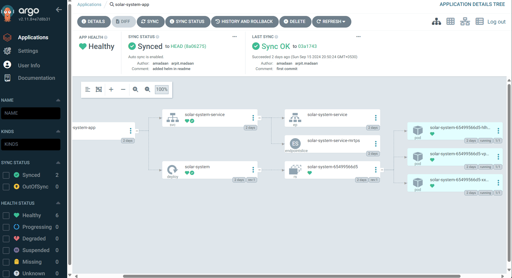

# ArgoCD Exercise

### What is the need of GitOps?

In a DevOps setup, whenever your application code changes, the new Docker image gets pushed to the registry via your CI pipeline, and the Kubernetes deployment file is updated with the new image tag. Sounds simple enough, right?

But then comes the tricky part: updating config maps, persistent volume claims (PVCs), services, and other Kubernetes resources. Often, these changes are applied manually using kubectl or Helm commands, and you may push this configuration to a remote Git repository... sometimes.

This manual process can lead to big problems:

- Configuration Drift: Manual changes aren’t always recorded in Git, leading to discrepancies between your cluster and your source of truth.
- No Testing or Review: Config changes applied directly to the cluster are often not reviewed or tested.
- No Disaster Recovery: What happens if your config wasn't pushed to Git? Recovery becomes a nightmare.
- Direct Cluster Access: CI pipelines or users often get direct write access to the cluster, increasing risk.

Gitops solves these problems by following a pull based model, where a GitOps operator will consistently check the state of Kubernetes cluster and match it with the desired state of git repository.

### Advantages of GitOps:
- Single source of truth
- Everything as a code including configuration, network, storage, policies etc.
- Continuous Deployment
- Easy Rollback
- Auditable
- Multi Cluster Deployments

### Drawback of GitOps:
- Secret management is complex and another overhead which was not the case in devops.

### Lets do a hands on exercise to get started with installation of ArgoCD and create our first app using different approaches:

1. Create the Namespace:
```bash
kubectl create namespace argocd
```
2. Install ArgoCD with the below command into your Kuberenetes cluster:
```bash
kubectl apply -n argocd -f https://raw.githubusercontent.com/argoproj/argo-cd/v2.11.8/manifests/install.yaml
```
3. Install jq if it does not exist:
```bash
sudo apt  install jq
```
4. Get the admin password for ArgoCD:
```bash
kubectl get secret argocd-initial-admin-secret -n argocd -o json | jq .data.password -r | base64 -d
```
5. Edit the service of ArgoCD server and change the Service type to NodePort and add the desired nodePort number:
```bash
kubectl edit svc argocd-server -n argocd
```
6. Install ArgoCD CLI:
Download the binary wherever you have write permissions
```bash
curl -sSL -o ~/argocd https://github.com/argoproj/argo-cd/releases/download/v2.4.11/argocd-linux-amd64
```
7. Give Execute permission:
```bash
chmod +x ~/argocd
```
8. Move it to bin directory so that it gets added to $PATH variable of our system:
```bash
sudo mv ~/argocd /usr/local/bin/
```
9. Check the version of ArgoCD:
```bash
argocd version
```
10. Login into ArgoCD server via CLI to perform further imperative commands:
```bash
argocd login <node-name:port>
username: admin
password
```
11. Now we will create our first app via CLI, which will be added in default Project with no restrictions. Use the following command and replace your git repository:

We need to create namespace 'solar-system' for the app as well, or use another existing namespace
```bash
argocd app create solar-system-app-2 \
--repo https://github.com/sidd-harth/gitops-argocd \
--path ./solar-system \
--dest-namespace solar-system \
--dest-server https://kubernetes.default.svc
```
12.  We have to sync the app manually, since we have chosen it to be manual for now.
Synchronize the solar-system-app-2 application using ArgoCD CLI:
```bash
argocd app sync solar-system-app-2
```
This is how the UI of ArgoCD should look like:

13. We can check the app solar-system is running or not in the browser:
```bash
http://<node-name-or-ip>:<port-number>
```

14. To change the reconciliation time to 1 minute for ArgoCD which is curently 3 minutes by default, use the following command:
```bash
kubectl -n argocd patch configmap argocd-cm --patch='{"data":{"timeout.reconciliation":"60s"}}'
```
or change in the conif map as below:
```yaml
data:
  timeout.reconciliation: 60s
```
15.  Otherwise if we want to avoid delay, we can configure a webook from our GitHub repository, but we need to make sure we have a secure certificate for ArgoCD if we want to use webhook else we can set the insecure flag in the ArgoCD deployment to accept unsecure connection as shown below:
```yaml
- command:
  - argocd-server
  - --insecure
```
Webhook can be added by going into the settings of GitHub and adding the url of ArgoCD into TargetUrl/Payload field for sending POST requests of push events:
```bash
<argo-cd-url>/api/webhook
```
16.  Instead of using a long argo create app command(which was imperative approach as shown above), we can use declarative approach in which all the details for ArgoCD are written in a yaml file, and we can create ArgoCD app with just a single below command:
```bash
kubectl apply -f declarative/single-app.yml
```
- Auto Pruning: Deletion of resources if the files have been removed from git.
- Self Heal: If any manual changes or drifts from the desired state occur, ArgoCD automatically corrects them by reapplying the correct configuration from the Git repository.

17.  We can also create a deployment via a helm chart and can also set helm values explicitly:
```bash
argocd app create nginx \
--repo https://charts.bitnami.com/bitnami \
--helm-chart nginx \
--revision 12.0.3 \
--values-literal-file values.yaml \
--helm-set service.type=NodePort \
--dest-namespace devops-tools \
--dest-server https://kubernetes.default.svc
```

18.  To create new user use below command:
```bash
kubectl -n argocd patch configmap argocd-cm --patch='{"data":{"accounts.arpit": "apiKey,login"}}'
argocd account list
argocd account update-password--account arpit
```
By default new users do not have any access, read rbac documentation for more details.

For Secret management Bitnami sealed secrets can be used or the Hashicorp Vault Plugin. Read the documentation for details.

Destroy the resources created to avoid extra costs.

#### If you find any mistakes or scope of improvement, please reach out to me at amadaan7@gmail.com
Follow me on LinkedIn: https://www.linkedin.com/in/arpitmadaan/

Follow me on Medium: https://medium.com/@amadaan7

